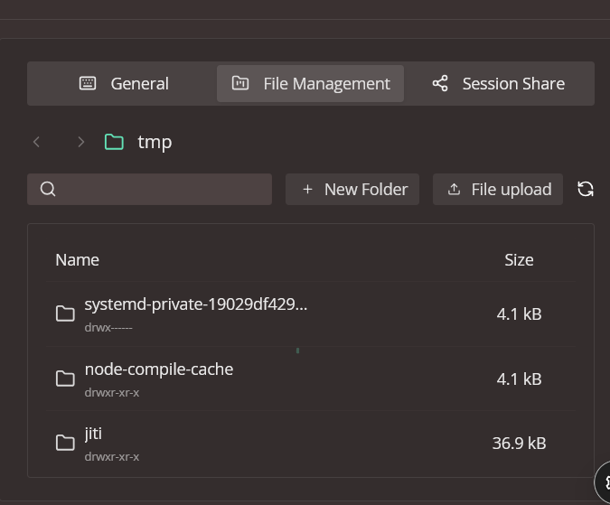
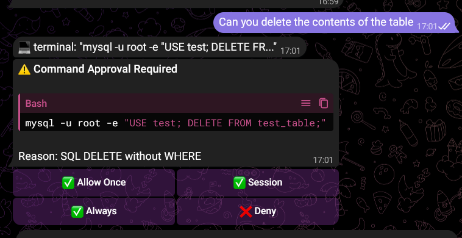
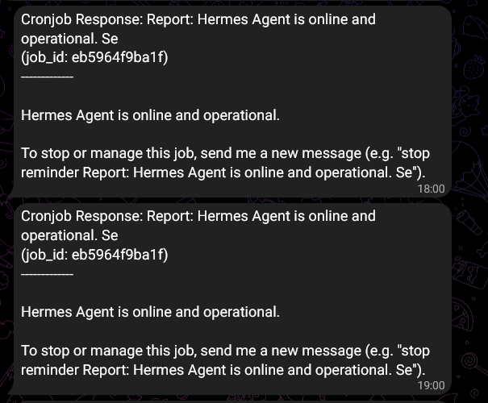
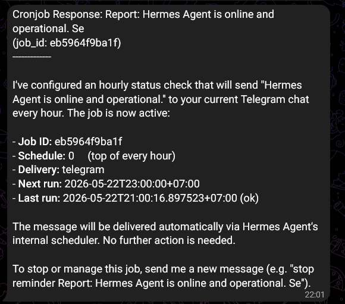
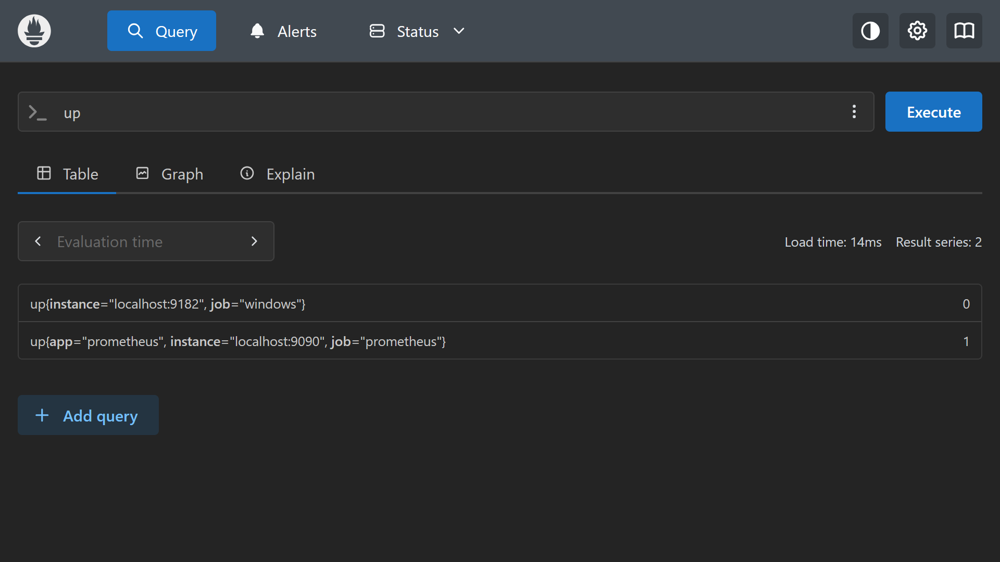
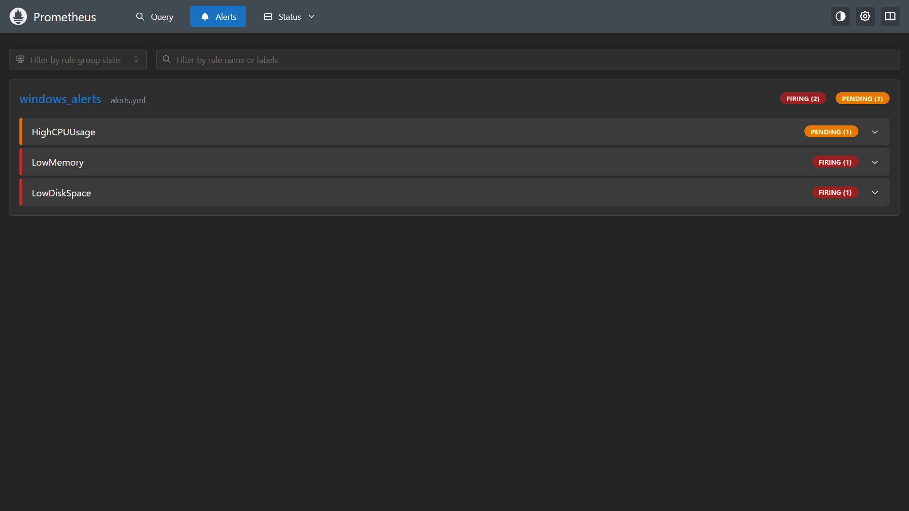
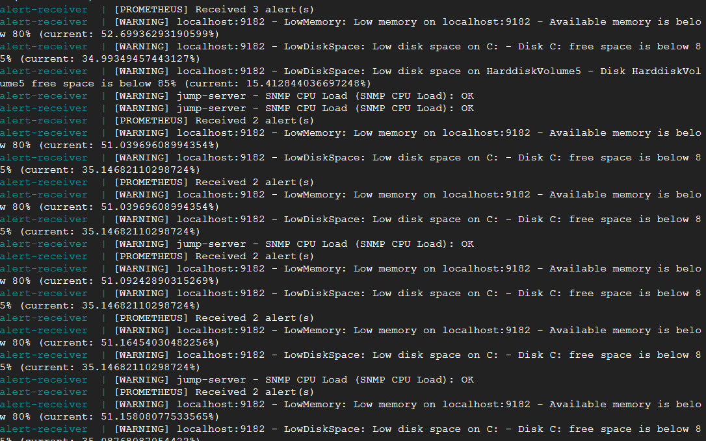
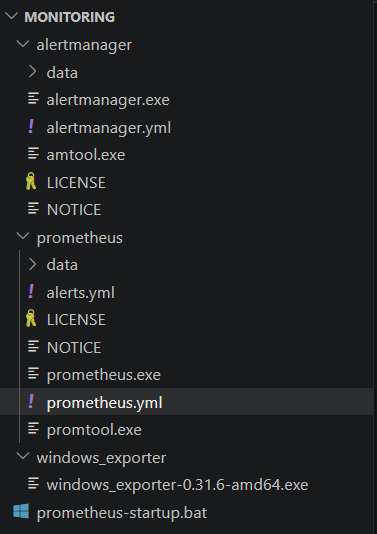

<h1 align="center">Thực hiện migrate hoàn toàn sang hệ thống linux ở JumpServer</h1>

Do thời gian free trial của Google Cloud đã kết thúc, em thực hiện migrate các file quan trọng sang hệ thống linux JumpServer do công ty cung cấp. Để migrate các directory lớn một cách thuận tiện, sử dụng archive bằng tar:

```
tar -czf <tên-directory>.tgz <directory-cần-archive>
```

Rồi thực hiện tải tar này sử dụng option tải single file về của Google Cloud VM. Sau đó add file tar này vào JumpServer:



File sẽ được chuyển vào /tmp, cần thực hiện mv tới directory cần thiết rồi extract:

```
tar -xzf openclaw-state.tgz
```

JumpServer và máy cá nhân được kết nối với nhau thông qua Tailscale, các địa chỉ IP trong stack PRTG và stack Prometheus đã được cập nhật.

**Đặc biệt: Migrate Openclaw:**

Để migrate Openclaw, cần backup state directory và workspace của Openclaw cũ (default là nằm trong ~/.openclaw/). Cụ thể những nội dung cần backup:

- Config: openclaw.json và các setting gateway.

- Auth: auth cho các AI model (API key, OAuth), các channel.

- Session: trạng thái agent, lịch sử hội thoại.

- Channel state: liên quan tới channel như đăng nhập Whatsapp, session Telegram.

- File workspace: MEMORY.md, USER.md, skills, prompts.

Note: nên chạy openclaw status để lấy path directory chính xác của Openclaw.

Các bước migrate:

1. Ngừng gateway và backup:

```
openclaw gateway stop
cd ~
tar -czf openclaw-state.tgz .openclaw
```

2. Cài đặt OpenClaw ở máy mới.

3. Chuyển archive tar sang máy mới và giải nén:

```
cd ~
tar -xzf openclaw-state.tgz
```

4. Chạy doctor và verify:

```
openclaw doctor
openclaw gateway restart
openclaw status
```

Sau khi migrate, cần kiểm tra:

- openclaw status để xem gateway có chạy hay ko.

- Các kênh vẫn được kết nối.

- Các file workspace như memory và config vẫn hoạt động bình thường.

<h1 align="center">Cập nhật trạng thái của các AI provider hiện tại</h1>

Trong thời gian gần đây, các AI provider đã có nhiều thay đổi:

- OpenAI/ChatGPT: Cần xác thực tài khoản bằng SDT để tiếp tục sử dụng OpenAI làm provider cho các agent như Openclaw và Hermes. SDT Việt Nam ko xác thực được -> Hiện tại không sử dụng OpenAI cho các agent được. Do đây là provider chính đang sử dụng -> cần tìm giải pháp thay thế.

- Ollama: tài khoản free ko còn sử dụng được một số model chính như kimi. Hiện tại đã sử dụng nemotron-3-super.

- Github Copilot: có free tier nhưng chỉ có những model cũ như GPT 4.0, 4.1, khả năng xử lý ko tốt bằng những model mới. Rate limit free cũng thấp, ko sử dụng làm giải pháp thay thế được.

- DuckDuckGo search: DuckDuckGo cung cấp API search tương tự như Brave Web Search nhưng ko cần API key, rất hữu ích và tiện lợi. Có thể cài đặt trực tiếp trong setup của Openclaw và Hermes.

Note: khi thay đổi model cho Openclaw nhiều dễ làm rối config model của Openclaw, cần vào config openclaw.json và tự set model chính cần sử dụng.

<h1 align="center">Giới thiệu về Hermes</h1>

Hermes là một AI agent tương tự như Openclaw, có thể hỗ trợ người dùng với nhiều tác vụ công việc như coding, tự động hóa, hẹn giờ... và có khả năng học hỏi trong quá trình làm việc và trao đổi với user. Tương tự như Openclaw, có thể chạy trên nhiều nền tảng như Linux, MacOS, Windows và chạy trong docker container... Có thể kết nối với nhiều model provider và channel khác nhau và có thể sử dụng provider custom hay local model.

Cài đặt Hermes (Linux): chạy command trong terminal:

Cách 1: Cài đặt qua pip:

```
pip install hermes-agent
hermes postinstall
```

Cách 2: git installer:

```
curl -fsSL https://raw.githubusercontent.com/NousResearch/hermes-agent/main/scripts/install.sh | bash
```

Cả 2 cách này đều sẽ cài đặt các dependency như NodeJS...

Quá trình cài đặt tương tự như cài đặt Openclaw, installation wizard hướng dẫn người dùng setup model provider, channel... Nếu hệ thống đã cài đặt OpenClaw, Hermes có thể thừa hưởng các setting của OpenClaw.

Tương tự như Openclaw, các file config và workspace của Hermes được lưu ở ~/.hermes. Config chính được lưu trong config.yaml. Cụ thể cấu trúc file như sau:

```
~/.hermes/
├── config.yaml     # Settings (model, terminal...)
├── .env            # API key và các thông tin mật khác
├── auth.json       # OAuth provider credentials (Github Copilot, OpenAI...)
├── SOUL.md         # Agent identity chính.
├── memories/       # Memory được lưu lại như MEMORY.md, USER.md
├── skills/         # Skill
├── cron/           # Các task cronjob do người dùng setup cho Hermes
├── sessions/       # Gateway session
└── logs/           # Logs
```

Một số command quan trọng sau khi đã cài đặt hermes (nhiều lệnh tương đồng với Openclaw):

hermes: thực hiện chat trực tiếp với model trong terminal.

hermes model: thực hiện setup hay thay đổi model.

hermes config: thực hiện config và setup Hermes.

hermes gateway start/stop/restart: bật, dừng và khởi động lại gateway.

hermes doctor : thực hiện kiểm tra các vấn đề trong Hermes. Thêm --fix vào để thực hiện auto repair nếu có thể. Khi thay đổi model, sẽ có thể có nhiều lỗi nên cần chạy lệnh này và restart gateway.

hermes update: update Hermes

hermes uninstall: gỡ cài đặt Hermes

Một số điểm khác biệt trong quá trình sử dụng:

- Hermes in ra các bước khi thực hiện task (VD: in ra các command linux đã sử dụng)

- Khả năng analyze data cỡ lớn kém hơn OpenClaw, không thể phân tích DB chứa các alert từ PRTG.

- VD: khi thực hiệnt tác vụ với MySQL, Openclaw sẽ khuyến cáo nên phân một user MySQL riêng cho nó còn Hermes thì ko quan tâm.

- Khi yêu cầu thực hiện lệnh quan trọng như xóa, Hermes sẽ hỏi người dùng trước.



- Người dùng có thể cho phép chạy allow once, cho phép trong riêng session này hoặc luôn cho phép.

- Chạy cronjob ko ổn định, tự thay đổi cronjob. VD: cronjob là cập nhật status của hermes trong chat telegram 3 tiếng 1 lần, tự thay đổi thành 1 tiếng 1 lần. Có thể là lỗi của model nemotron-3-super.





- Cronjob là cập nhật status của hermes trong chat telegram 3 tiếng 1 lần. Lúc đầu Hermes thực hiện task này đúng như ý muốn nhưng sau một vài lần lại chuyển sang chạy 1 tiếng 1 lần rồi tự ý thay đổi cronjob. Có thể là lỗi của model nemotron-3-super.

- Openclaw và Hermes có thể giao tiếp với nhau, đơn giản nhất là qua một file text
  - [Một cuộc hội thoại đơn giản giữa 2 agent](files/empty.txt)

- Khi có lỗi xảy ra trong quá trình sử dụng, Hermes sẽ in ra các bước thực hiện retry và lỗi cụ thể. Khi ngừng gateway, Hermes sẽ báo lại cụ thể trong kênh chat.

- Trong quá trình setup kênh (Telegram), Hermes sẽ yêu cầu user ID cụ thể của người dùng để xác định người được quyền chat với Hermes qua kênh đó.

**Kết luận**: Hermes có ưu điểm là rõ ràng trong quá trình thực hiện công việc. Có lưu tâm tới vấn đề bảo mật tuy nhiên, output ko để tâm tới vấn đề bảo mật như Openclaw. Hiệu quả công việc tương tự với Openclaw nên ko cần chuyển sang Openclaw nếu đã sử dụng Openclaw.

<h1 align="center">Prometheus</h1>

Prometheus là một hệ thống monitoring và alerting mã nguồn mở dùng để thu thập, lưu trữ và phân tích số liệu theo thời gian thực. Prometheus thường được dùng để giám sát server Linux, Docker, các ứng dụng backend, database, thiết bị network, API... Prometheus được sử dụng phổ biến và rộng rãi và có nhiều ứng dụng và công cụ phụ trợ do công đồng phát triển để mở rộng tính năng cho Prometheus.

Có nhiều cách để cài đặt và chạy Prometheus: chạy trực tiếp precompiled binary, cài đặt qua package manager, chạy trong Docker, build từ source code... Trong ứng dụng lần này là sử dụng Prometheus để monitor một máy tính chạy Windows, sẽ sử dụng cách chạy trực tiếp precompiled binary:

Link: https://github.com/prometheus/prometheus/releases

Sau khi tải xuống và giải nén, cần tạo một file config [prometheus.yml](files/prometheus/prometheus.yml)

- global là chỉ cấu hình mặc định cho toàn bộ Prometheus.
  - scrape_interval: chu kì Prometheus sẽ gọi tới endpoint /metrics để lấy dữ liệu.

  - evaluation_interval: chu kì Prometheus sẽ kiểm tra alert rules.

- alerting: khai báo nơi gửi alert
  - Alertmanager sẽ chạy tại localhost:9093. Khi Prometheus phát hiện có alert thì sẽ gửi tới đây để alert manager có thể gửi tới các nơi khác.

- rule_files: Prometheus sẽ load file alert rule ở đây.

- scrape_configs: định nghĩa nơi Prometheus scrape thông tin:
  - job_name: đặt tên cho nguồn thông tin (job) của Prometheus.

  - Scrape ở port 9090 => tự monitor chính mính.

  - Job "windows" ở port 9182: scrape từ windows_exporter để lấy các thông tin của máy tính windows như CPU, memory, disk, network...

Sau khi hoàn thiện config, chạy trực tiếp prometheus qua .exe hoặc chạy lệnh prometheus.exe --config.file=prometheus.yml và truy cập web UI tại port 9090:



- Chạy up để kiểm tra trạng thái các job của Prometheus. Có thể thấy đang monitor được chính nó nhưng ko monitor được windows do chưa chạy windows_exporter.

**Query trong Prometheus**

Prometheus sử dụng ngôn ngữ query PromQL. Có 2 loại query chính:

- Instant query: giá trị tại thời điểm hiện tại. VD: up sẽ hiển thị trạng thái up của các job trong prometheus (job được định trong config)

- Range query: giá trị trong một khoảng thời gian nhất định. VD: rate(windows_cpu_time_total[5m])

Các thành phần tạo nên query:

- Metric name: có thể coi là tên biến cho các thông tin của data source, trong trường hợp này là thông tin về máy tính windows. VD: windows_memory_available_bytes là lượng memory còn dư tính bằng byte.

- Label filtering: các thành phần thêm vào để lọc thêm. VD: windows_logical_disk_free_bytes{volume="C:"} sẽ kiểm tra disk free ở ổ đĩa C

Các kí hiệu so sánh: = (giống) != (khác) =~ (match regex) !~ (không match regex)

- Function: các hàm tính toán. Một số hàm phổ biến:
  - rate()/irate(): tính rate. VD: rate(windows_net_bytes_received_total[5m]): tính toán byte per second của đầu vào network interface trong 5 phút trước.

  - increase(): tính tổng . VD: increase(windows_net_bytes_received_total[1h]): tổng lượng data network interface đã nhận trong 1h trước.

  - avg_over_time(), max_over_time(): tính trung bình hoặc max trong một khoảng thời gian.

  - sum, avg, max, min.

**windows_exporter**: một ứng dụng addon trong stack Prometheus để cho phép nó monitor được các hệ thống chạy Windows. Exporter sẽ expose các metric như CPU, memory, disk, network... dưới dạng json để Prometheus có thể monitor.

Link: https://github.com/prometheus-community/windows_exporter/releases

Cách sử dụng: tải xuống và chạy trực tiếp.

**alertmanager**: là thành phần xử lý alert trong stack Prometheus. Prometheus có thể monitor và kiểm tra dựa theo alert rule nhưng ko thể tự gửi notification tới các địa điểm khác. Alertmanager có thể gửi noti tới nhiều kênh khác nhau và webhook.

Link: https://github.com/prometheus/alertmanager/releases

Cách sử dụng: tải xuống và tạo file config cho alertmanager [alertmanager.yml](files/prometheus/alertmanager.yml)

- route: xác định routing rule mặc định, quyết định alert sẽ đi tới đâu, group như thế nào, bao lâu từ gửi lại noti.
  - receiver: alert sẽ default là đi tới đây.

  - group_by: thông thường sẽ group alert cùng tên lại với nhau nhưn ở đây để trống do ko cần group theo label nào cả.

  - group_wait: khi alert đầu tiên xuất hiện, alertmanager sẽ chờ trước khi gửi noti.

  - group_interval: thời gian đợi giữa các noti trong cùng 1 group, tránh spam.

  - repeat_interval: thời gian gửi lại noti nếu alert vẫn còn tồn tại.

- receiver: nơi nhận alert. Trong config lần này, 'alert-receiver' là một webserver chạy trên 1 máy khác đang expose một webhook để alertmanager có thể gửi alert tới.
  - send_resolved: true: khi alert được giải quyết => gửi noti thông báo.

- inhibit_rules: khi 1 alert xuất hiện thì sẽ suppress alert khác. Nếu có alert quan trọng hơn ở mức critical thì sẽ được ưu tiên hơn mức warning.

Sau khi tạo config, chạy trực tiếp .exe hoặc chạy lệnh alertmanager.exe --config.file=alertmanager.yml

Để có alert để gửi đi, cần tạo alert rule cho prometheus [alerts.yml](files/prometheus/alerts.yml). Đây là nơi chứa các alert rule mà Prometheus sẽ đối chiếu để kiểm tra và gửi alert nếu các rule đã vượt ngường.

- Trong file lần này có 3 rule để monitor 3 thông số: CPU, memory và disk. Mỗi alert có query riêng, thời gian chờ (for), label và mô tả. Các giá trị trong file này là placeholder để phục vụ testing alert:

- Giải thích query:

CPU load:

```
100 - (avg by (instance) (irate(windows_cpu_time_total{mode="idle"}[5m])) * 100) > 10
```

- window_cpu_time_total: tổng thời gian CPU đã chạy ở từng instance (đối với CPU, một instance là một core hay thread)

- {mode="idle"}: chỉ lấy thời gian CPU ở trạng thái idle

- irate(...[5m]): tính tốc độ tăng tức thời trong 5 phút trước

- avg by (instance): lấy trung bình của tất cả các core

- 100 - (... \* 100): đổi sang % và lấy thời gian non-idle.

Memory:

```
(windows_memory_available_bytes / windows_memory_physical_total_bytes) * 100 < 80
```

- windows_memory_available_bytes: dung lượng RAM còn available

- windows_memory_physical_total_bytes: tổng dung lượng RAM vật lý.

=> tính % RAM còn trống

Disk free (ổ C):

```
(windows_logical_disk_free_bytes{volume="C:"} / windows_logical_disk_size_bytes{volume="C:"}) * 100 < 85
```

- windows_logical_disk_free_bytes{volume="C:"}: số byte còn trống của ổ C

- windows_logical_disk_size_bytes{volume="C:"}: tổng dung lượng của ổ C

=> tính disk free.

Sau khi setup alert rule thành công, đặt file vào cùng folder với prometheus. Chạy cả 3 windows_exporter, alertmanager và Prometheus để hoàn thiện stack.

Prometheus monitor và kiểm tra alert rule thành công:



Kiểm tra ở phía alert-receiver thì thấy alert được gửi thành công:



**Note**: để tiện lợi cho việc chạy stack này, có thể tạo một file script để chạy cả 3 ứng dụng cùng lúc [prometheus-startup.bat](files/prometheus/prometheus-startup.bat).

Script này có thể ngừng hoạt động của những process đang chạy và chạy cả 3 ứng dụng cùng 1 lúc và in ra các port mà ứng dụng đang chạy để người dùng dễ dàng truy cập.

Cấu trúc file của stack Prometheus nên như sau:



Mô hình hoạt động của stack: windows_exporter -> prometheus -> alertmanager.

<h1 align="center">Alert receiver</h1>

Giải pháp gọn nhẹ để tổng hợp các alert từ nhiều nguồn khác nhau. Hai nguồn hiện tại đang sử dụng là PRTG và Prometheus. PRTG chạy trên một máy Windows và thực hiện monitor 1-2 máy Linux. Prometheus thực hiện monitor chính máy Windows này. Các máy tính này được kết nối với nhau thông qua Tailscale.

Giải pháp: đặt các alert vào cùng một bảng trong database, đánh dấu nguồn rõ ràng (PRTG, Prometheus), đánh dấu hệ thống được monitor, thời gian cụ thể...

2 ứng dụng này gửi alert có format như sau:

Prometheus:

```
{
    "status":"firing",
    "labels":{"alertname":"LowDiskSpace","instance":"localhost:9182",
    "job":"windows",
    "severity":"warning",
    "volume":"C:"},
    "annotations":{"description":"Disk C: free space is below 85% (current: 35.63177100901998%)","summary":"Low disk space on C:"},"startsAt":"2026-05-25T08:52:07.032Z","endsAt":"0001-01-01T00:00:00Z",
    "generatorURL":"http://DuyTL-TTS:9090/graph?g0.expr=%28windows_logical_disk_free_bytes%7Bvolume%3D%22C%3A%22%7D+%2F+windows_logical_disk_size_bytes%7Bvolume%3D%22C%3A%22%7D%29+%2A+100+%3C+85&g0.tab=1",
    "fingerprint":"ac2d32df5de54b39"
}
```

PRTG:

```
{
    "device":"jump-server",
    "deviceid":"2129",
    "sensor":"SNMP CPU Load (SNMP CPU Load)",
    "sensorid":"2148",
    "status":"Threshold reached (Total)",
    "message":"OK",
    "lastvalue":"1 %",
    "priority":"***",
    "group":"Jump Server",
    "probe":"Local Probe",
    "datetime":"4/28/2026 10:38:15 AM",
    "linkdevice":"https://DuyTL-TTS.mshome.net/device.htm?id=2129",
    "linksensor":"https://DuyTL-TTS.mshome.net/sensor.htm?id=2148","down":"(<1 %)"
}
```

Cần một bảng bao quát hết được các thông tin trong alert được gửi đi, có thể bỏ những cột chứa link như linkdevice hay generatorURL do chúng ko cần thiết trong việc monitoring.

Alert receiver sẽ sử dụng SQLite làm database (nhỏ gọn, dễ sử dụng). Bảng sẽ sử dụng:

```
  CREATE TABLE IF NOT EXISTS alerts (
    id INTEGER PRIMARY KEY AUTOINCREMENT,
    source TEXT,
    device TEXT,
    device_id TEXT,
    sensor TEXT,
    sensor_id TEXT,
    status TEXT,
    severity TEXT,
    message TEXT,
    last_value TEXT,
    priority TEXT,
    group_name TEXT,
    probe TEXT,
    down_time TEXT,
    device_url TEXT,
    sensor_url TEXT,
    timestamp DATETIME DEFAULT CURRENT_TIMESTAMP,
    raw TEXT
  )
```

Những cột quan trọng

- source: chỉ nguồn của alert (PRTG, Prometheus)

- device: chỉ thiết bị đang bị monitor.

- sensor: chỉ tên của sensor, cho biết alert liên quan tới sensor hay vấn đề gì.

- status: trạng thái của yếu tố đang bị monitor.

- severity: mức độ nghiêm trọng của alert: warning hoặc critical.

- message: đoạn tin nhắn được gửi kèm alert. 

- raw: lưu lại đoạn alert raw từ các ứng dụng monitor với mục đích lưu trữ, backup, lịch sử.


